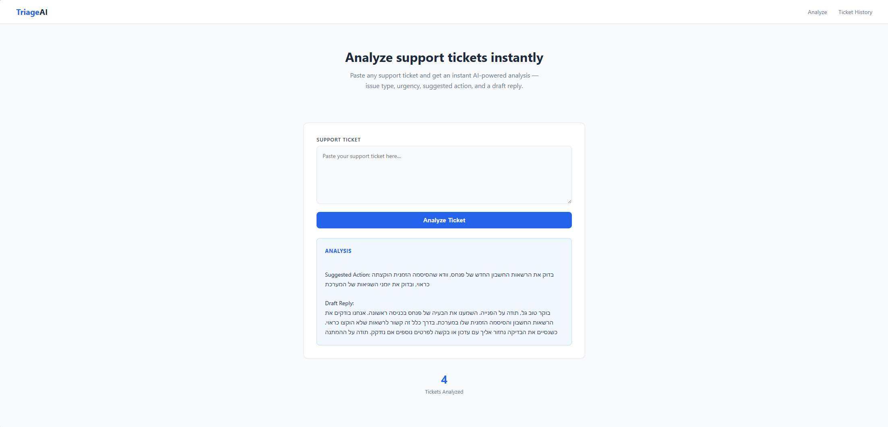

A personal AI journey for self improvement

## TriageAI

**Live:** https://ticket-triage-3ldt.onrender.com

### What is it?

TriageAI is an AI-powered support ticket analyzer built for technical support agents. Paste any support ticket and get an instant structured analysis.

### Features

- Issue type classification (Permission, Expense Report, Accounting, Interface, Other)
- Urgency level detection (Low, Medium, High)
- Suggested action for the support agent
- Draft reply to send to the customer
- Hebrew language support
- Full ticket history saved to database

### Screenshots

### Tech Stack

- **AI:** Claude API (Anthropic)
- **Backend:** Python, Flask
- **Database:** Supabase (PostgreSQL)
- **Deployment:** Render
- **Automation:** Make.com

### Technical Decisions

- **Claude Haiku** — chosen for speed and cost efficiency. Haiku gives fast responses at low cost, ideal for high-volume ticket analysis.
- **Supabase** — free PostgreSQL database with a simple Python SDK. Persistent storage that survives server restarts, unlike JSON files.
- **Flask** — lightweight Python web framework. Minimal setup, easy to deploy, fits a single-feature tool perfectly.
- **Render** — free hosting with automatic GitHub deployments. Every push to main deploys automatically.

### Why I built it

I work in technical support and wanted to automate the initial triage process. This tool helps support agents respond faster and more consistently to incoming tickets.

---

## About this repository

This repo documents my hands-on learning path — every project here was built from scratch as part of a structured daily learning habit.

# Expect generic responses as the AI does not know your work system -

I intentionally kept this as a triage tool rather than a full resolution agent because without system documentation, Claude can't give specific answers — and I'm not willing to sacrifice accuracy for automation #
